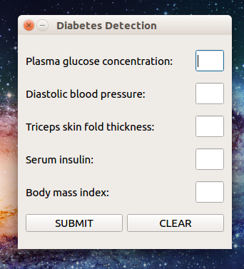

# Diabetes predictions application in Python

This application is made using sklearn machine learning libraries and pyqt5 for its graphical user interface.
Support Vector Machine classifies input data with a 80% accuracy. We have choosen the PIMA indians diabetes dataset from UCI archive.



## USAGE

Firstly install all dependencies via the following command.

```bash
pip3 install -r requirements.txt
```

Now train the application in you pc as

```bash
python3 diabetes.py
```

Finally run the application :

```bash
python3 gui.py
```
Now insert all the requires details.